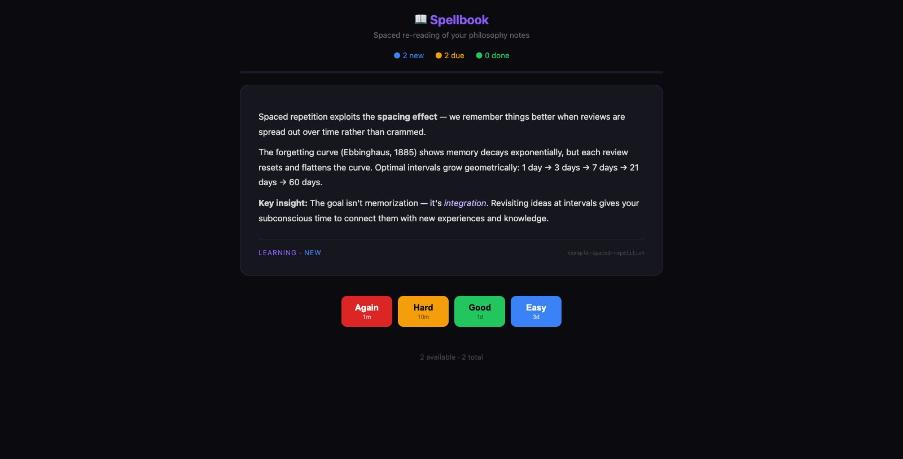

# 📖 Spellbook

**Spaced repetition for ideas — an [OpenClaw](https://openclaw.ai) skill.**

Spellbook is a self-hosted spaced repetition app designed not for memorization, but for **idea integration**. It resurfaces your best thinking at increasing intervals so insights connect with new experiences over time.

Your OpenClaw agent generates review cards from your conversations, notes, and content — then prompts you to review them at optimal intervals.



## What It Does

- 📝 **Your agent creates cards** from conversations, articles, transcripts, or anything worth revisiting
- ⏰ **Spaced intervals** — cards reappear at 10min → 1hr → 1 day → 3 days → 1 week → 1 month (adjusted by your ratings)
- 📱 **PWA-ready** — add to your phone's home screen for an app-like experience
- 🌙 **Dark mode** — easy on the eyes, mobile-friendly
- 🔄 **Rating system** — Again / Hard / Good / Easy adjusts future intervals
- 💾 **State persists** — review progress saved server-side, survives refreshes

## Quick Install (OpenClaw)

### Option 1: ClawHub (coming soon)
```bash
npx clawhub install spellbook
```

### Option 2: Git clone
```bash
git clone https://github.com/humanitylabs-org/vault-review.git ~/.openclaw/skills/spellbook
```

Your agent will auto-detect the skill on next session.

## Setup

### 1. Start the server

```bash
python3 ~/.openclaw/skills/spellbook/scripts/server.py --port 8787
```

You should see:
```
📖 Spellbook server on http://localhost:8787
```

### 2. Open in your browser

Navigate to `http://localhost:8787` — you'll see the review app with example cards.

### 3. Add to phone home screen (PWA)

To use Spellbook as a standalone app on your phone:

**iPhone (Safari):**
1. Open your server URL in Safari (use your machine's local IP or Tailscale URL)
2. Tap the Share button (⬆️)
3. Tap "Add to Home Screen"
4. Name it "Spellbook" → tap Add

**Android (Chrome):**
1. Open the URL in Chrome
2. Tap the three-dot menu (⋮)
3. Tap "Add to Home screen" or "Install app"
4. Confirm

Now you have a home screen icon that opens Spellbook without browser chrome.

### 4. Remote access

If you want to access Spellbook from your phone when away from home:

- **Tailscale:** If your Mac is on Tailscale, use your Tailscale URL (e.g., `http://your-machine.tailnet:8787`)
- **Local network:** Use your Mac's local IP (e.g., `http://192.168.1.x:8787`)

## How Your Agent Uses It

Once installed, your OpenClaw agent can:

### Add cards from conversations
Tell your agent: *"Add this to my Spellbook"* or *"I want to remember this idea"*

The agent reads `cards.json`, creates a new card capturing the insight, and appends it.

### Generate cards from content
Give your agent an article or transcript and say: *"Turn the key ideas into Spellbook cards"*

The agent extracts 3-7 key insights and creates well-formatted cards.

### Card format
Cards are stored in `cards.json`:
```json
{
  "id": "unique-slug",
  "domain": "Category",
  "title": "Card Title",
  "content": "Markdown content — supports **bold**, *italic*, lists, links.",
  "releaseDate": "2026-03-22"
}
```

## How Review Works

1. Open Spellbook — due cards are presented one at a time
2. Read the card, think about it
3. Rate it:
   - **Again** — didn't connect, show again soon
   - **Hard** — recognized but needs more time
   - **Good** — connected, schedule normally
   - **Easy** — deeply integrated, push out further
4. The algorithm adjusts the next review interval based on your rating

This isn't about memorizing facts — it's about keeping important ideas in active rotation so they influence your thinking.

## Configuration

### Custom data directory
Store cards separately from the skill:
```bash
python3 scripts/server.py --port 8787 --dir ~/my-spellbook-data
```

### Custom port
```bash
python3 scripts/server.py --port 9999
```

### Run as a background service (macOS)
Create a LaunchAgent for auto-start — ask your OpenClaw agent to set this up for you.

## Contributing

Found a bug? Want to improve the UI? PRs welcome!

1. Fork this repo
2. Make your changes
3. Submit a PR

Your OpenClaw agent can even do this for you — just tell it what to fix and ask it to open a PR.

## License

MIT

---

Built by [Humanity Labs](https://github.com/humanitylabs-org) • Powered by [OpenClaw](https://openclaw.ai)
